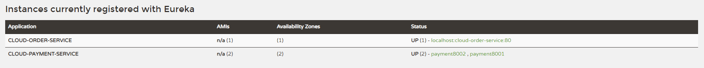
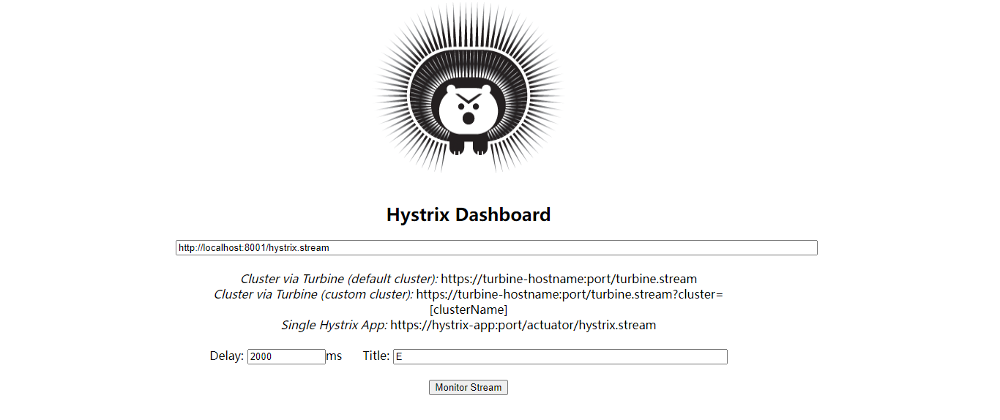
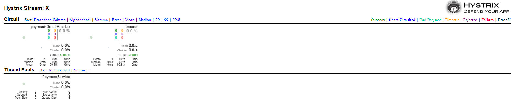
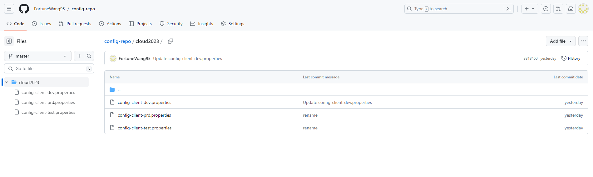
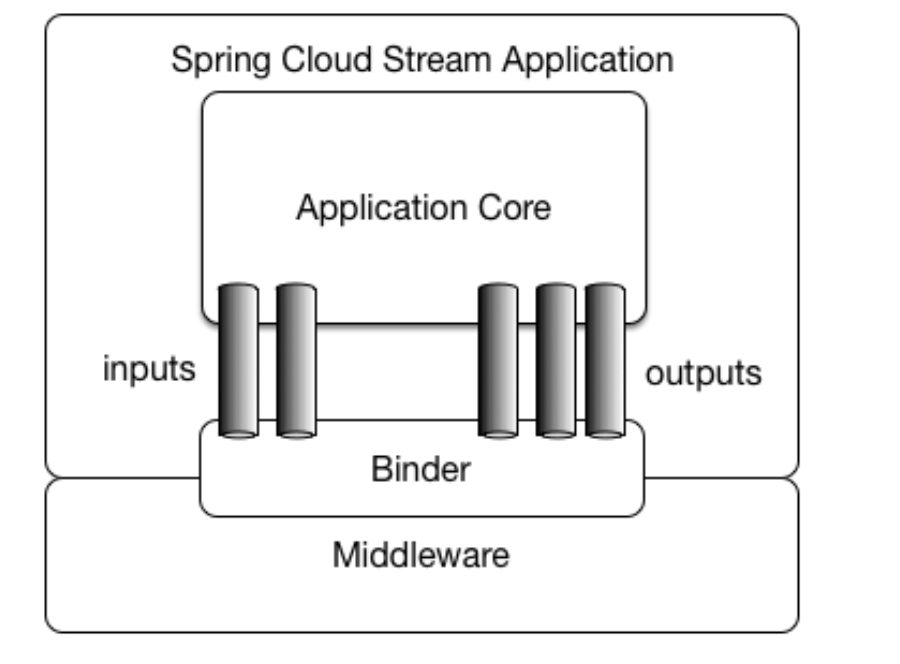

# Introduction
I wrote down this note during learning Spring Cloud. The whole project contains 17 modules. It may look awful. Actually, you don't need to run them all. You only need to run combination of several moudles to demonstrate one Spring Cloud Module.

## Preperation
The project is based on JDK1.8 and built on Maven, uses Mysql(5.7+) and Rabbit MQ.
Make sure you use dependencies with the same versions as below. Using other versions may cause unexpected error.
| Dependency | Version |
| ---------- | ------- |
| spring-cloud-dependencies | Hoxton.SR1 |
| spring-boot-dependencies | 2.2.2.RELEASE |

One step left before you moving on, run `mvn clean` and `mvn install` for module cloud-api-commons, which contains only two entities used in other modules. I avoid code repetition in this way.
```Java
@Data
@AllArgsConstructor
@NoArgsConstructor
public class CommonResult<T> {
    private Integer code;
    private String message;
    private T data;
}
```
```Java
@Data
@AllArgsConstructor
@NoArgsConstructor
public class Payment implements Serializable {
    private Long id;
    private String serial;
}

```
# Spring Cloud Components
> Spring Cloud provides tools for developers to quickly build some of the common patterns in distributed systems (e.g. configuration management, service discovery, circuit breakers, intelligent routing, micro-proxy, control bus, short lived microservices and contract testing).

Spring Cloud is a huge community. Many companies (Netflix, Alibaba) made contributions for this community, then Spring Cloud adopted these technology as memebers in Spring Cloud community. While some old technology is not continuted, then new technology emerged.

To implement service discovery, you have four options：Netflix Eureka, Zookeeper, Consul and Alibaba Nacos. So which option should we choose and which do I use in this project? I made a list to break it down.


1. Service Discovery
   - **Netflix Eureka**  <sub>not continuted</sub>
   - Zookeeper
   - Consul
   - _Alibaba Nacos_ <sub>a good option to replace Eureka </sub>
2. Service Call
   - **Netflix Ribbon**
   - LoadBalancer <sub>this one intends to replace Ribbon gradually</sub>
   - ~~Netflix Feign~~ <sub>not continuted,not recommend to use</sub>
   - **OpenFeign** <sub>a good option to replace Feign</sub>
3. Service Fallback and Circuite breaker
   - **Netflix Hsytrix** <sub>not continuted</sub>
   - Resilience4j
   - _Alibaba Sentinel_ <sub>a good option to replace Hystrix</sub>
4. Gateway
   - ~~Netflix Zuul~~ <sub>be not continuted</sub>
   - ~~Netflix Zuul2~~ <sub>not release now,still in the development progress</sub>
   - **Spring Cloud Gateway**
5. Configuration Management
   - **Spring Cloud Config** <sub>not continuted</sub>
   - _Alibaba Nacos_ <sub>a good option to replace Bus</sub>
6. Bus
   - **Spring Cloud Bus** <sub>not continuted</sub>
   - _Alibaba Nacos_ <sub>a good option to replace Bus</sub>

The bold items are used in this project. You may notice that Spring Cloud Alibaba seems a good option. Yes, it is indeedly. Unfortunately, this project doesn't involve Spring Cloud Alibaba.


#  Netflix Eureka
You only need to run involved modules. Run servers first then clients.

## Eureka Server 
There are two eureka server instances, each of them point to each other. Two instances work together, one crashes, another still can work.

| Module Name               | port |
|---------------------------| ------------- |
| cloud-eureka-server       |  7001 |
| cloud-eureka-servr-backup | 7002 |

`EurekaServerApplication.java`
``` Java
@SpringBootApplication
@EnableEurekaServer //add this annotation to indicate a eureka server insatnce
public class EurekaServerApplication { 
    public static void main( String[] args ) {
        SpringApplication.run(EurekaServerApplication.class,args);
    }
}
```
`application.yml`
``` yml
eureka:
  instance:
    hostname: eureka7001.com
  client:
    register-with-eureka: false #indicates eureka server doesn't need register itself
    fetch-registry: false #indicates eureka server doesn't need register itself
    service-url:
      defaultZone: http://eureka7002.com:7002/eureka/ #pointed to another eureka insatnces

```

## Eureka Client
| Module Name | Service Provider | Service Consumer | port |
|-------------|-----------|------------------|------|
| cloud-project-order         |           | Y                | 80   |
| cloud-project-payment | Y         |                  | 8001 |

```java
@SpringBootApplication
@EnableEurekaClient //add this annotation to indicate a eureka client
@RibbonClient(name = "CLOUD-PAYMENT-SERVICE",configuration = CustomizedRobinRule.class)
//ignore @RibbonClient, we will discuss this annotation later
public class OrderApplication {
    public static void main( String[] args ) {
        SpringApplication.run(OrderApplication.class,args);
    }
}
```
``` yml
spring:
  application:
    name: cloud-order-service #indicates the service name

eureka:
  instance:
#    instance-id: order80
    prefer-ip-address: true
  client:
    register-with-eureka: true #register this service in eureka server
    fetch-registry: true #register this service in eureka server
    service-url: #eureka server cluster has two instances
      defaultZone: http://eureka7001.com:7001/eureka/,http://eureka7002.com:7002/eureka/

```
visit localhost:7001 or localhost:7002 via browser

Modify property `eureka.instance.insatnce-id` will impact how to display in eureka server dashboard, the default display pattern is `${hostname}:${spring.application.name}:${server.port}`

# Netflix Ribbon 
Before moving on, make sure you have already run eureka servers. Run these modules as below.

| Module Name                  | Service Provider/Consumer | service name          | port |
|------------------------------|---------------------------|-----------------------|------|
| cloud-project-order          | Service Consumer          | cloud-order-service   | 80   |
| cloud-project-payment        | Service Provider          | cloud-payment-service | 8001 |
| cloud-project-payment-backup | Service Provider          | cloud-payment-service | 8002 |

**Notice: same microservice applications should have same service name.**


## Service Provider
cloud-payment-service is a simple application, expose several web endpoints, query data from DB then return.
There are two cloud-payment-service instances running.

`PaymentApplication.java`
```java
@SpringBootApplication
@EnableEurekaClient
@EnableDiscoveryClient //now microservice applications can know each other
public class PaymentApplication {
    public static void main( String[] args ) {
        SpringApplication.run(PaymentApplication.class,args);
    }
}
```
`application.yml`

```yml
server:
  port: 8001
spring:
  application:
    name: cloud-payment-service
  datasource: #build a mysql datasource
    type: com.alibaba.druid.pool.DruidDataSource
    driver-class-name: org.gjt.mm.mysql.Driver
    url: jdbc:mysql://localhost:3306/db2023?useUnicode=true&characterEncoding=utf-8&useSSL=false
    username: root
    password: root
mybatis: #mybatis mapper setting
  config-location: classpath:mybatis-config.xml
  mapperLocation: classpath:mapper/*.xml
  type-aliases-package: org.ilearn.springcloud.entities
```
create a table in Mysql, and insert a few sample data
```sql
CREATE TABLE `payment` (
  `id` bigint NOT NULL AUTO_INCREMENT COMMENT 'ID',
  `serial` varchar(200) DEFAULT '',
  PRIMARY KEY (`id`)
) ENGINE=InnoDB AUTO_INCREMENT=42 DEFAULT CHARSET=utf8mb3;
```
`PaymentController.java`

autowired a `DiscoveryClient` into controller, now we can know other services and instances via discoveryClient.Try to call this Get Request.
```java
@RestController
@RequestMapping("/payment")
@Slf4j
public class PaymentController {
    @Autowired
    private DiscoveryClient discoveryClient;
    @GetMapping("/discovery")
    public Object discovery() {
        List<String> services = discoveryClient.getServices();
        for (String service: services){
            log.info("*******element: "+service);
        }
        List<ServiceInstance> instances = discoveryClient.getInstances("CLOUD-PAYMENT-SERVICE");
        for (ServiceInstance instance:instances){
            log.info(instance.getServiceId()+"\t"+instance.getHost()+"\t"+instance.getPort()+"\t"+instance.getUri());
        }
        return discoveryClient;
    }
}
```

## Service Consumer
We are going to let order-service to call payment-service. To implement this, we combine Ribbon and RestTemplate.
One consumer instance, two provider instances, default call rule is Round-Robbin.

`OrderApplication.java`
```java
@SpringBootApplication
@EnableEurekaClient
@RibbonClient(name = "CLOUD-PAYMENT-SERVICE",configuration = CustomizedRobinRule.class)
/*name indicates service provider's name, 
configuration indicates to override default robbin rule,
if you don't want to override default robbin rule, don't get a value to configuration key*/
public class OrderApplication {
    public static void main( String[] args ) {
        SpringApplication.run(OrderApplication.class,args);
    }
}
```
`ApplicationContextConfig.java`
```java
@Configuration
public class ApplicationContextConfig {
    @Bean
    @LoadBalanced
    //@LoadBalanced indicates to open Load Balance function, default rule is Round-Robbin
    public RestTemplate getRestTemplate(){
        return new RestTemplate();
    }
}
```
`CustomizedRobbinRule.java`
```java
@Configuration
public class CustomizedRobinRule {
    @Bean
    public IRule myRule(){
        //default rule is Round-robbin, here switch to random rule
        return new RandomRule();
    }
}
```
#  OpenFeign
Robbin has already implemented Load Balancing. Why do we still need OpenFeign? Let's look back on Robbin.
The drawback is hard coding. With OpenFeign, we can implement Load Balancing more elegantly.

`OrderController.java`
```java
@RestController
@Slf4j
@RequestMapping("/consumer")
public class OrderController {
    //hard code here
    private static final String PAYMENT_SERVICE = "http://CLOUD-PAYMENT-SERVICE";
    @Autowired
    private RestTemplate restTemplate;
    
    @GetMapping("/payment/get/{id}")
    public CommonResult<Payment> getPayment(@PathVariable("id") Long id){
        return restTemplate.getForObject(PAYMENT_SERVICE +"/payment/get/"+id,CommonResult.class);
    }
}
```

| Module Name                  | Service Provider/Consumer | service name          | port |
|------------------------------|---------------------------|-----------------------|------|
| cloud-project-order-feign    | Service Consumer          | cloud-order-service   | 80   |
| cloud-project-payment        | Service Provider          | cloud-payment-service | 8001 |
| cloud-project-payment-backup | Service Provider          | cloud-payment-service | 8002 |

**Notice: Do not run cloud-project-order-feign and cloud-project-order together.**

## Service Provider
No extra config on provider side.

## Service Consumer
The feature of OpenFeign is that we only need to declare an interface, OpenFeign creates dynamic implementation of the interface automatically for us

```java
@SpringBootApplication
@EnableFeignClients //this annotation is required
public class OrderFeignApplication {
    public static void main( String[] args ) {
        SpringApplication.run(OrderFeignApplication.class,args);
    }
}
```
```java
@Component
@FeignClient(value = "CLOUD-PAYMENT-SERVICE")
//declare service provider's name
public interface PaymentFeignService {
    @GetMapping("/payment/get/{id}")
    CommonResult<Payment> getPaymentById(@PathVariable("id") Long id);

    @GetMapping("/payment/feign/timeout")
    String paymentTimeout();
}
```
```java
@Configuration
public class FeignConfig {
    @Bean
    Logger.Level feignLoggerLevel(){
        //set the logger level to full, we can view most details
        return Logger.Level.FULL;
    }
}
```
`application.yml`
```yml
ribbon:
  #default timeout is 1s, we will use read time out in later session:Hystrix
  ReadTimeout: 5000
  ConnectTimeout: 5000
logging:
  level:
    # feign logger monitors which service at which level
    org.ilearn.springcloud.service.PaymentFeignService: debug
```

# Netflix Hystrix
The features of Hystrix are Service Fallback and Circuit Breaker.

**Notice:eureka server instances are required to be in running state before moving on.**

| Module Name                   | Service Provider/Consumer | service name                | port |
|-------------------------------|---------------------------|-----------------------------|------|
| cloud-project-order-hystrix   | Service Consumer          | cloud-order-service-hystrix | 80   |
| cloud-project-payment-hystrix | Service Provider          | cloud-payment-service       | 8001 |
| cloud-hystrix-dashboard       | N/A                       | N/A                         | 9001 |

## Service Fallback
### Fallback on Service Provider
The common two reasons of Service Fallback on Service Provider are Runtime Exception and Time Out.

`PaymentHystrixApplication.java`
```java
@SpringBootApplication
@EnableEurekaClient
@EnableCircuitBreaker //required annotation
public class PaymentHystrixApplication {
    public static void main( String[] args ) {
        SpringApplication.run(PaymentHystrixApplication.class,args);
    }
}
```
We have two methods to set up fallback. One is to add `@HystrixCommand` on given method, set up fallback for given service.
Another is to add `@HystrixCommand` on `PaymentService`, which set tp a global fallback.
Actually, we have a better method to set up fallback, we can decouple service logic and fallback logic, you will view it in the later session.

```java
@Service
@DefaultProperties(defaultFallback = "globalFallBack")
public class PaymentService {
    /**
     * Mock a simple healthy service
     */
    public String ok(Integer id) {
        return "Ok service returns the result： "+id;
    }

    /**
     * Mock a time-consuming service
     */
    @HystrixCommand(fallbackMethod = "timeoutHandler", commandProperties = {
            @HystrixProperty(name = "execution.isolation.thread.timeoutInMilliseconds",value = "5000")
    })
    public String timeout(Integer id) {
        try {
            TimeUnit.SECONDS.sleep(3);
        } catch (InterruptedException e) {
            e.printStackTrace();
        }
//        int age = 2/0;
        return "Timeout service returns the result : "+id;
    }

    public String timeoutHandler(Integer id) {
        return "Payment service is going through an extreme high volume of request or encountered an unexpected exception. Please invoke later.";
    }

    public String globalFallBack(){
        return "Current service is going through an extreme high volume of request or encountered an unexpected exception. Please invoke later.";
    }
}
```

### Fallback on Service Consumer
You can see the difference of fallback configuration on Service Consumer.

```java
@SpringBootApplication
@EnableFeignClients
@EnableHystrix //different annotation with Service Consumer side
public class OrderHystrixApplication {
    public static void main( String[] args ) {
        SpringApplication.run(OrderHystrixApplication.class,args);
    }
}
```

```yml
feign:
  hystrix:
    enabled: true
```
We decoupled service logic and fallback logic perfectly in this way.
```java
@Component
@FeignClient(name = "CLOUD-PAYMENT-SERVICE-HYSTRIX",fallback = PaymentFallBackService.class)
public interface PaymentHystrixService {
    @GetMapping("/payment/hystrix/ok/{id}")
     String ok(@PathVariable("id")Integer id);
    @GetMapping("/payment/hystrix/timeout/{id}")
     String timeout(@PathVariable("id")Integer id);
}

@Component
public class PaymentFallBackService implements PaymentHystrixService{
   @Override
   public String ok(Integer id) {
      return "FallBackService: Current service encountered an unexpected exception or the related services are hectic. Please invoke later.";
   }
   @Override
   public String timeout(Integer id) {
      return "FallBackService : Current service encountered an unexpected exception or the related services are hectic. Please invoke later.";
   }
}
```


## Circuit Breaker
The relationship between Circuit Breaker and Service Fallback is subtle. Circuit Breaker can be viewed as a special service fallback.
Theoretically, service fallback emerges too much times and too often will cause circuit breaker.

```java
@Service
public class PaymentService {
    @HystrixCommand(commandProperties = {
            @HystrixProperty(name = "circuitBreaker.enabled",value = "true"),
            @HystrixProperty(name = "circuitBreaker.requestVolumeThreshold",value = "10"),
            @HystrixProperty(name = "circuitBreaker.sleepWindowInMilliseconds",value = "10000"),
            @HystrixProperty(name = "circuitBreaker.errorThresholdPercentage",value = "60")
    })
    /**
     * These four annotations indicates that, 
     * if 60% of 10 incoming requests fall backs in 10 seconds, circuit breaker will open
     */
    public String paymentCircuitBreaker(Integer id){
        if(id<0){
            throw new RuntimeException("id must be grater than 0.");
        }
        String serialNo = IdUtil.simpleUUID();
        return "Invoke succeed, serial Number is "+serialNo;
    }
    
}
```

## Hystrix Dashboard
Hystrix also provide a dashboard for us to monitor service states conveniently.
The dashboard will automatically monitor service states in near real time. We have to set up configurations to enable Hystrix Dashboard.
```java
@SpringBootApplication
@EnableHystrixDashboard
public class HystrixDashboardApplication {
    public static void main(String[] args) {
        SpringApplication.run(HystrixDashboardApplication.class,args);
    }
}
```
The blow configuration is required in cloud-project-payment-hystrix.
```java
@Configuration
public class HystrixConfig {

    /**
     * Required configuration if you want to use Hystrix Dashboard to monitor this microservice
     * seems like a system bug in spring cloud
     * @return ServletRegistrationBean
     */
    @Bean
    public ServletRegistrationBean getServlet(){
        HystrixMetricsStreamServlet streamServlet = new HystrixMetricsStreamServlet();
        ServletRegistrationBean registrationBean = new ServletRegistrationBean(streamServlet);
        registrationBean.setLoadOnStartup(1);
        registrationBean.addUrlMappings("/actuator/hystrix.stream");
        registrationBean.setName("hystrix.stream");
        return registrationBean;
    }
}
```
```yaml
hystrix:
  dashboard:
    proxy-stream-allow-list: '*'
    
management:
  endpoints:
    web: #expose web endpoint to let hystrix dashboard to monitor
      base-path: /
      exposure:
        include: '*'
```

Now, visit http://localhost:9001/hystrix. You will view this website.

Input the exposed web endpoint(http://localhost:8001/hystrix.stream), input default delay 2000ms, input title. Then you will view Hystrix Dashboard.


# Spring Cloud Gateway
Three critical components of Gateway are Routes, Predicates and Filters.

| Module Name           | service name          | port |
|-----------------------|-----------------------|------|
| cloud-gateway         | cloud-gateway         | 9527 |
| cloud-project-payment | cloud-payment-service | 8001 |

There are dozens of property configurations. View full details on [Spring Cloud Gateway Documentation](https://docs.spring.io/spring-cloud-gateway/docs/3.0.8/reference/html/#gateway-request-predicates-factories).

```yaml
spring:
  application:
    name: cloud-gateway
  cloud:
    gateway:
      discovery:
        locator:
          enabled: true #create dynamic routes through eureka server
      routes:
        - id: payment_routh #route's ID, no fixed rule, ID should be unique, suggest use service name as prefix
#          uri: http://localhost:8001
          uri: lb://cloud-payment-service
          predicates:
            - Path=/payment/get/**
        - id: payment_routh2
#          uri: http://localhost:8001
          uri: lb://cloud-payment-service
          predicates:
            - Path=/payment/create/**
#            - After=2023-12-28T14:43:46.917+08:00[Asia/Shanghai]
#            - Before=2023-12-28T14:43:46.917+08:00[Asia/Shanghai]
#            - Between=2023-12-28T14:43:46.917+08:00[Asia/Shanghai],2023-12-29T14:43:46.917+08:00[Asia/Shanghai]
#            - Cookie=key,value
#            - Header=X-request-Id, \d+ #first param is header name, second param is reg expression
#            - Host=**.somehost.org,**.anotherhost.org
#            - Method=GET,POST #this route matches if the request method was a GET or a POST
#            - Query=red, gree.  #The  route matches if the request contained a red query parameter whose value matched the gree. regexp, so green and greet would match.
#            - RemoteAddr=192.168.1.1/24 #This route matches if the remote address of the request was, for example, 192.168.1.10.

#          This route would forward ~80% of traffic to weighthigh.org and ~20% of traffic to weighlow.org
#            routes:
#              - id: weight_high
#                uri: https://weighthigh.org
#                predicates:
#                  - Weight=group1, 8
#              - id: weight_low
#                uri: https://weightlow.org
#                predicates:
#                  - Weight=group1, 2
```

# Spring Cloud Config
Spring Cloud Config provides a centralized config repository for microservice applications. The default config repo is GitHub.

You need to install Rabbit MQ in your local enc and run it before moving on.


| Module Name                | service name  | port |
|----------------------------|---------------|------|
| cloud-config-server        | config-server | 3344 |
| cloud-config-client        | config-client | 3355 |
| cloud-config-client-backup | config-client | 3366 |

## Config Server

```yaml
spring:
  application:
    name: config-server
  cloud:
    config:
      server:
        git: #indicates load properties from cloud2023 folder in my another repository(config-repo)
          uri: https://github.com/FortuneWang95/config-repo.git
          search-paths:
            - cloud2023
          label: master
```



```java
@SpringBootApplication
@EnableConfigServer
public class ConfigServerApplication {
    public static void main( String[] args ) {
        SpringApplication.run(ConfigServerApplication.class,args);
    }
}
```

## Config Client
**Notice : we need to replace application.yml with bootstrap.yml, because bootstrap.yml has higher priority.**

```yaml
spring:
  application:
    name: config-client
  cloud:
    config:
      label: master #branch name
      name: config-client #name of config file
      profile: dev #suffix of config file, config-client-dev.yml/.properties in master branch will be loaded
      uri: http://localhost:3344
```

```java
@RestController
@RefreshScope //this annotation is required in later session: Spring Cloud Bus
public class ConfigClientController {
    //according to yaml config, this value will be loaded from config-client-dev.properties in master label
    @Value("${config.profile.version}")
    private String profile;
    @GetMapping("/profile/version")
    public String getProfile(){
        return profile;
    }
}

```

# Spring Cloud Bus
Now git repository restores configuration files. Config Client loads properties through Config Server, Config Server loads properties from git repository. 
A new problem emerges. What if we modify the config in git repository, how to broadcast modification to all related config clients?

Then Spring Cloud Bus emerges. Spring Cloud Bus links Config Server and Config Clients. We expose a web endpoint on Config Server. 
After modification in git repo, we call this web endpoint (localhost:3344/actuator/bus-refresh) manually, then Config Server will broadcast modification to Config Clients via message queue.

```yaml
rabbitmq:
  host: localhost
  port: 5672
  username: guest
  password: guest

#expose an endpoint for bus refresh
management:
  endpoints:
    web:
      exposure:
        include: 'bus-refresh'
```

# Spring Cloud Stream
There are four message queues widely used in software development. They are Kafka, Rabbit MQ, Rabbit MQ and Active MQ. It's a disaster for developers to learn how to use four mqs.

Then Spring Cloud Stream emerges. It provides out-of-box usage, isolates the gap between various MQs. But it only supports Kafka and RabbitMQ right now.


| Module Name                  | service name           | port |
|------------------------------|------------------------|------|
| cloud-stream-publisher       | cloud-stream-publisher | 8801 |
| cloud-stream-receiver        | config-stream-receiver | 8802 |
| cloud-stream-receiver-backup | config-stream-receiver | 8803 |

## Message Publisher

```yaml
spring:
  application:
    name: cloud-stream-publisher
  cloud:
    stream:
      binders:
        defaultRabbit:
          type: rabbit
          environment:
            spring:
              rabbitmq:
                host: localhost
                port: 5672
                username: guest
                password: guest
      bindings:
        output: #means send message
          destination: studyExchange
          content-type: application/json
          binder: defaultRabbit
```
```java
@EnableBinding(Source.class)
@Slf4j
public class MessageProviderImpl implements MessageProvider{
    @Autowired
    private MessageChannel output;

    @Override
    public void send() {
        String uuid = UUID.randomUUID().toString();
        Message<String> message = MessageBuilder.withPayload(uuid).build();
        output.send(message);
        log.info("*********** Sent message : "+uuid);
    }
}
```
## Message Receiver
```yaml
spring:
  application:
    name: cloud-stream-receiver
  cloud:
    stream:
      binders:
        defaultRabbit:
          type: rabbit
          environment:
            spring:
              rabbitmq:
                host: localhost
                port: 5672
                username: guest
                password: guest
      bindings:
        input: #means receive message
          destination: studyExchange
          content-type: application/json
          binder: defaultRabbit
          group: groupA # message receiver instances in the same group are competing with each other, only one message receiver instance can receive one message at one time
```

```java
@Component
@EnableBinding(Sink.class)
@Slf4j
public class MessageListener {
    @Value("${server.port}")
    private String port;
    @StreamListener(Sink.INPUT)
    public void receive(Message<String> message){
        log.info("Message Recevier from port "+port+" recevied mesage : "+message);
    }
}
```


  
